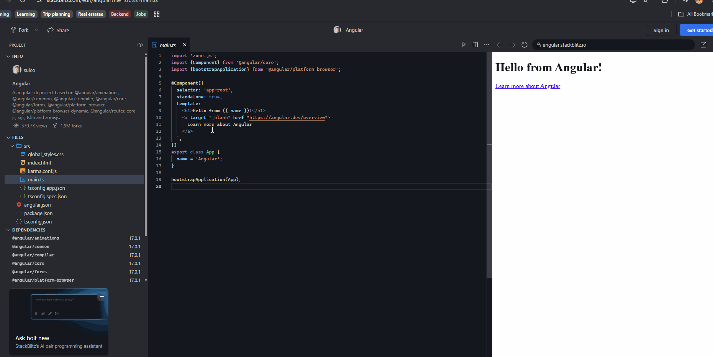

# angular-notes
This Repository contains information related Angular concepts.

1. [Template interpolation in angular](#template-interpolation-in-angular)
1. [Directives in angular](#directives-in-angular)
    1. [Component directives in angular](#component-directives-in-angular)
    1. [Structural directives in angular](#structural-directives-in-angular)
1. [Why we need directives in angular](#why-we-need-directives-in-angular)
1. [Life cycle in angular](#life-cycle-in-angular)
1. [Interceptors in angular](#interceptors-in-angular)

## template-interpolation-in-angular
Template interpolation in angular means you can refer to the variables declared in .ts (component.ts) file.
eg:
```
{{totalCount}} -> Sample.component.html file
totalCount:number=50 -> Sample.component.ts file
```

## directives-in-angular
A directive is a class in Angular that extends the functionality of HTML elements by changing their behavior, structure, or appearance.

## types-of-directives-in-angular
In angular there are three types of directives
-  Component directives
-  Structural directives
-  Attribute directives

## component-directives-in-angular
In Angular, a Component is fundamentally a directive with a template. It is the most common type of directive and serves as the primary building block for creating user interfaces. Under the hood, Angular's @Component decorator extends the @Directive decorator to add template-oriented features.In Angular, a Component is fundamentally a directive with a template. It is the most common type of directive and serves as the primary building block for creating user interfaces. Under the hood, Angular's @Component decorator extends the @Directive decorator to add template-oriented features.



## structural-directives-in-angular
Structural directives in Angular are special directives that change the structure of the DOM. They can add, remove, or repeat HTML elements.

## why-we-need-directives-in-angular
Without directives, HTML is static.
Directives allow you to:

Show or hide elements
Repeat elements
Change styles dynamically
Listen to events
Create reusable behaviors

## life-cycle-in-angular
Angular components use the below flow in thier component lifecycle 

Constructor
      ↓
ngOnChanges()
      ↓
ngOnInit()
      ↓
ngDoCheck()
      ↓
ngAfterContentInit()
      ↓
ngAfterContentChecked()
      ↓
ngAfterViewInit()
      ↓
ngAfterViewChecked()
      ↓
(Repeated during every change detection)
      ↓
ngOnDestroy()

## interceptors-in-angular
In Angular, Interceptors are services that intercept HTTP requests and responses made using HttpClient. They allow you to modify requests before they are sent to the server and process responses before they reach your components.

```Component
    |
    v
HttpClient
    |
    v
Interceptor(s)
    |
    v
Backend Server
    |
    ^
Response
    |
Interceptor(s)
    |
    ^
Component
```
